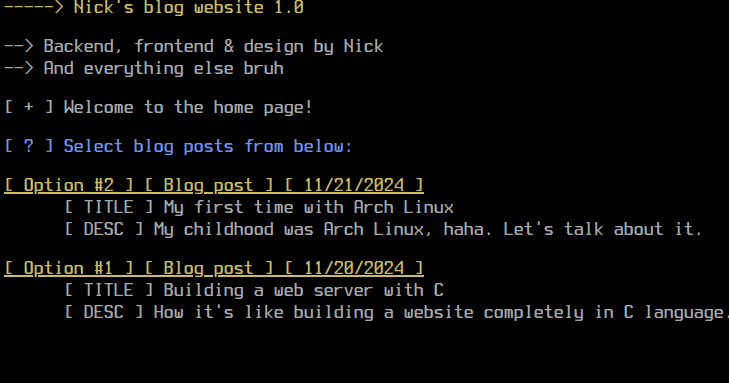
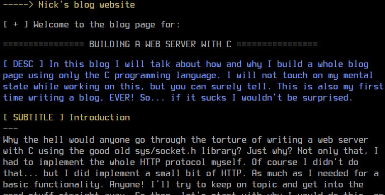
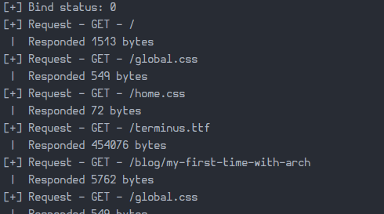

# Nicks blog website

A blog web page written completely in C language. REALLY?! Nah, I scammed you. The frontend is written in plain old HTML/CSS. There's no way around it other than using WASM or something. But the whole backend server is written in C using sys/socket.h. Might not work on Windows LOL.

Here's what the website's home page looks like:



I tried to make it look like a terminal, since most C programs are "terminal based" and look like that.

Here's one of the "blogs" I wrote:



I am not a good writer.

Here's what the server output looks like when navigating the frontend:



Very cool.

## Running the code

Just compile it with this command:

```shell
$ cc main.c views.c strutils.c
```

Or open your eyes slightly wider and notice the damn `Makefile`.